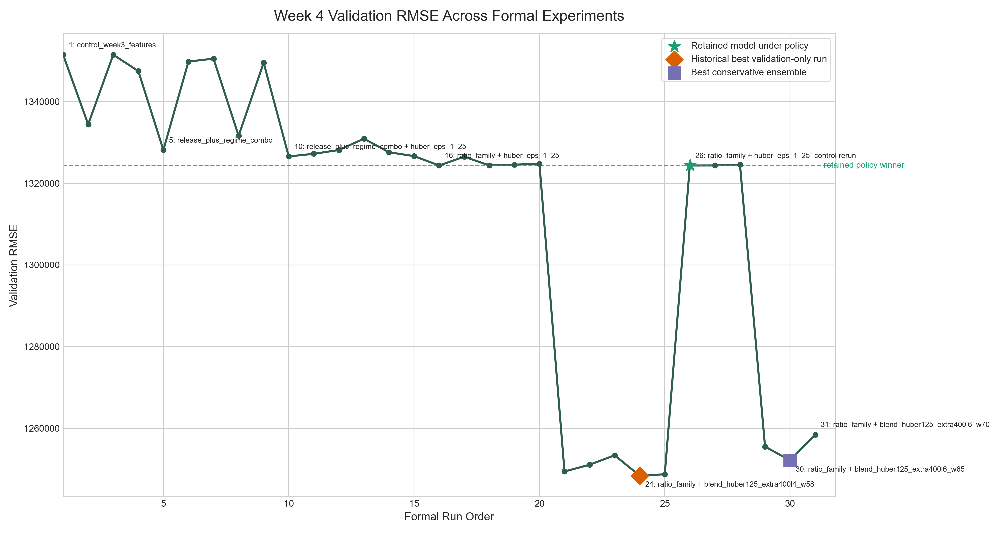

# Week 5 Deliverables

Week 5 reuses the already completed Week 4 autonomous-block outputs. Per the
assignment instruction, no new agent run was performed for this submission
because the required experiment evidence, plot, and analysis artifacts were
already finished and logged.

## Deliverable 1: Complete Experiment Log Bundle

Primary bundle files:

- `experiments/experiment_log.tsv`
- `experiments/experiment_detail_log.tsv`

Supporting context:

- `week4_experiment_result_matrix.md`
- `week4_controlled_experiment_set.md`
- `evaluation_board.md`

What this bundle contains:

- validation metrics written by the frozen runner
- detailed model and feature-change metadata for the formal Week 4 runs
- keep/discard rationale for each formal experiment
- explicit separation between formal runs and repeated verification/final-eval
  sync rows

## Deliverable 2: Metric Trajectory Plot

Artifact:

- `week4_metric_over_time.png`

The plot tracks validation RMSE across the 31 formal Week 4 experiments.

## Deliverable 3: Keep / Discard / Crash Summary

Week 5 wrapper summary:

- `week5_keep_discard_crash_summary.md`

Primary supporting artifacts:

- `week4_experiment_result_matrix.md`
- `experiments/experiment_detail_log.tsv`

## Deliverable 4: Best Result vs. Baseline

Week 5 wrapper summary:

- `week5_best_result_vs_baseline.md`

Primary supporting artifacts:

- `experiments/experiment_log.tsv`
- `evaluation_board.md`
- `week4_experiment_result_matrix.md`

## Deliverable 5: "What Actually Worked" Memo

Week 5 wrapper memo:

- `week5_what_actually_worked_memo.md`

Primary supporting artifacts:

- `week4_failure_analysis_memo.md`
- `week4_controlled_experiment_set.md`
- `week4_experiment_result_matrix.md`

## Submission Notes

- Official baseline for course reporting remains `ridge_baseline`.
- Current retained model remains `search_week4_ratio_family_huber_eps_1_25_v1`.
- Historical best validation-only run remains
  `search_week4_ratio_family_blend_huber125_extra400l4_w58_v1`.
- Formal experiment accounting uses the 31 numbered Week 4 runs only.
- Repeated verification and final-eval reruns documented in
  `experiment_detail_log.tsv` are not counted as separate formal experiments.
